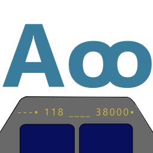
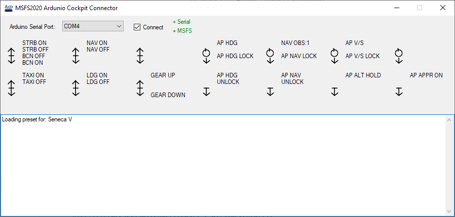
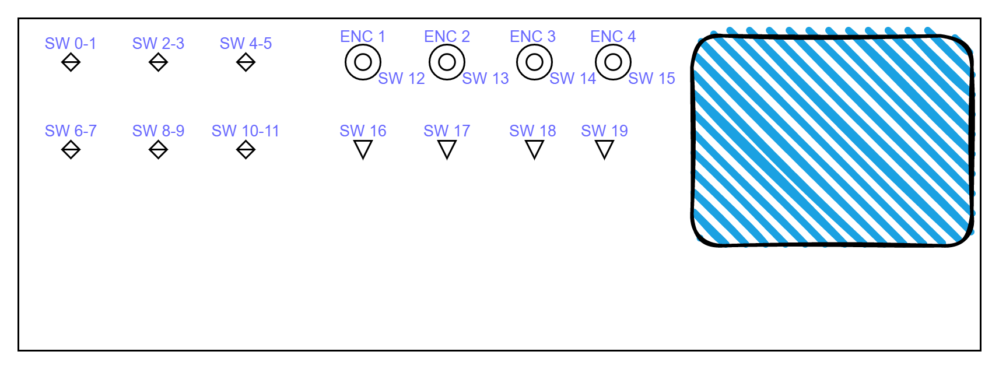
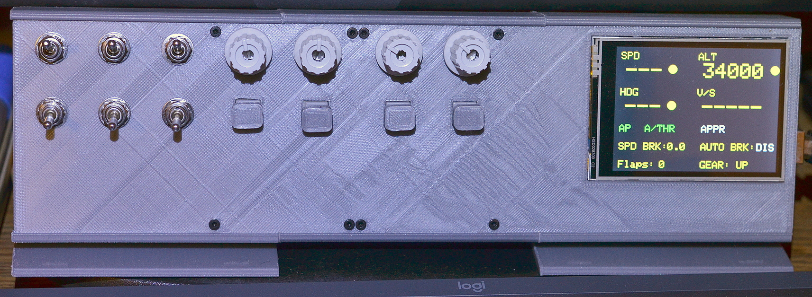
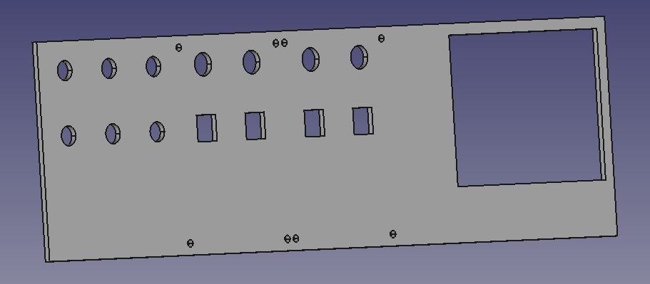
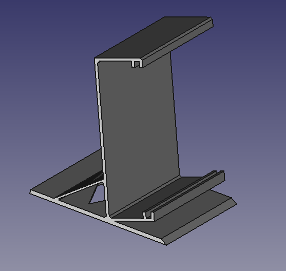
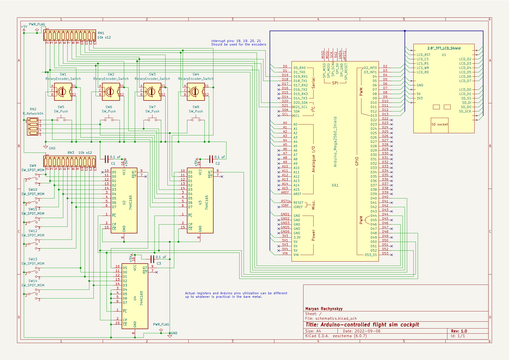

  
# Microsoft Flight Simulator Arduino-driven Cockpit

## Introduction

This project a yet another Arduino-driven cockpit that uses inexpensive hardware components and simple configurable software components.

Compatible with MSFS 2020 and 2024.

The code is heavily based on the original SimConnect sample [SimvarWatcher](https://docs.flightsimulator.com/html/Samples_And_Tutorials/Samples/SimvarWatcher.htm).

## Windows Sim Connector

MSFS Arduino Cockpit Connector is a mediator between the cockpit Arduino controller and the MSFS simulator.

Arduino is connected through the native Serial over the USB interface.

MSFS connection is done through the SimConnect API. It is expanded with the [MobiFlight WASM module](https://github.com/Mobiflight/MobiFlight-WASM-Module), since that is the only way to access L-variables and other internal entities.

Before using this software - please copy the folder *mobiflight-event-module* from [MSFS2020-module](MSFS2020-module) to your MSFS Community folder. You can also get the most recent version of this module from the [main MobiFlight distribution](https://github.com/MobiFlight/MobiFlight-Connector/tree/main/MSFS2020-module).

Start the Cockpit Connector application. Once Arduino is connected to USB and the MSFS is started, click on the "Connect" box - the indicators to the right will show if the connection to the Arduino and MSFS were successful.



As long as "Connect" box is checked, the application will try reconnecting to the simulator and Arduino.

Once the connections are established, Sim Connector checks the aircraft model which is currently loaded in MSFS, and tries to find the most appropriate dashboard layout for it.

Dashboard layouts are currently hard-coded in the C# code. Later we plan to implement dynamic layouts loading from the plain text files.

Currently available presets:
 * **Default** - a very simple preset that is loaded by default
 * **Beechcraft Bonanza G36**
 * **Beechcraft Piston Duke**
 * **Cessna 152**
 * **Cessna 152 Neofly Banner Tow version**
 * **Cessna 172 Skyhawk G1000**
 * **Cessna C208 B Grand Caravan**
 * **Diamond Aircraft DA40NG**
 * **Diamond Aircraft DA62**
 * **FlyByWire A320neo**
 * **FlyByWire A380**
 * **Headwind A330-900neo** - actually identical to FBW A320neo
 * **PA34T SENECA V**
 * **PMDG Boeing 737**


To make it easier remembering all the switches designations an active preset actions mapping is also shown on the screen.

If you create your own JSON preset - keep in mind the following lifehack. Double-click on the preset name shows on the screen the JSON interpretation as it was understood by the application.

## Dashboard Layout



We use 6 three-position switches (SW1-SW12), 4 rotary encoders (ENC1 - ENC4) with built-in buttons (SW13-SW16), and 4 push buttons (SW17-SW20).

2.8 TFT screen on the right side is used to show the instrument indications.



## Presets Definition

All layout presets are stored as JSON files in the "presets" folder.

Please note - for the KOHLSMAN controls we assume either "millibars" or "inHg" are used as a unit of measure.

The format of the JSON file is the following:

```
{
  "presetName": "PA34T SENECA V", // a free-form text which is shown on the main screen to identify the preset activated
  "aircraftName": "Seneca V",     // the aircraft name which should exactly correspond to the "ATC MODEL" variable value
  "bgColor": "0000",              // screen background color in the RGB
  "screenFieldItems": [           // the screen fields definition section - these are fields which are shown on the screen and can be changed by the knobs
                                  // screenFieldItems can contain any reasonable number of entries
    {
      "visibilityCondition": "", // optional visibility statement. If empty or not specified - the field is always visible.
                                 // If not empty - the visibility evaluation condition should be specified.
                                 // The unit of measure may be embedded into WASM variable definition, or after a comma for a regular SimConnect variable.
                                 // Unit of measure is optional.
                                 // Format: "SOMEWAR,SOMEUNIT=SOMEVALUE"
                                 // Ex: "FLAPS HANDLE INDEX,enum=1"
                                 //     "FLAPS HANDLE INDEX=1"
                                 //     "(L:A32NX_FLAPS_HANDLE_INDEX,enum)=1"
      "text": "HDG",         // the initial text to be shown on the screen
      "x": "010",            // X coordinate of the top left corner of the field on the screen
      "y": "010",            // Y coordinate of the top left corner of the field on the screen
      "color": "FFE0",       // text color
      "fontSize": "2",       // relative font size (normally - between 1 and 4)
      "textWidth": 0,        // field width in characters, if zero - a "text" length is taken instead
      "simVariable": "",     // the name of the Sim variable to bind the field to
      "simEvent": "",        // the name of Sim event which is triggered if we need to change the variable value (helpful for read-only vars)
      "unitOfMeasure": "",   // the unit of measure, i.e.: "feet", "inHg"
      "simvarType": 0,       // simple values are just shown on the screen, booleans have two text/color variants
                             // 0 - TYPE_STRING - the value is shown as string
                             // 1 - TYPE_NUMBER - the value is rounded as defined by decimalPoints, padded with leading spaces
                             // 2 - TYPE_P0_NUMBER - the value is rounded as defined by decimalPoints, padded with leading zeroes
                             // 3 - TYPE_BOOLEAN - a special processing is performed if value is 1.0 (true) or 0.0 (false)
      "decimalPlaces": 0,    // the number of decimals after the point
      "altText": "",         // for boolean - text to show if value=false
      "altColor": "",        // for boolean - color to use if value=false
      "knobSpec": "",        // If set - associates the item with the dashboard encoder.
                             // Format: NmmmmmmMMMMMMC
                             // N - knob ID ('0' - '3'),
                             // mmmmmm - minimum value (can have a leading minus sign)
                             // MMMMMM - maximum value (can have a leading minus sign)
                             // C - if 'Y' change the value in circle (when the knob rolls bellow the minumum, the value changes to max and vise versa).
                             // Example: 1000000000359Y
      "knobStep": ""         // Knob step specification. If it is parsable to integer (i.e. "0100") - this hard-coded value is taken.
    },
    ...
  ],
  "switchDefItems": [                // the switches behavior definition section
    {                                // this section should contain precisely 20 entries, as this is the number of physical switches in our dashboard
      "switchLabel": "STRB ON\nOFF", // the label to be shown in the main window (so the user will remember the switch purpose)
      "simEventOn": "STROBES_ON",    // the Sim event that should be triggered if switch turns ON
      "simEventOnValue": 0,          // the value that should be send along with the ON event
      "simEventOff": "STROBES_OFF",  // the Sim event that should be triggered if switch turns OFF
      "simEventOffValue": 0          // the value that should be send along with the OFF event
    },
    ...
  ]
}
```

**Additional comments on JSON format:**
 * All color values are coded in the RGB565 format (see more details here: [http://www.barth-dev.de/online/rgb565-color-picker/](http://www.barth-dev.de/online/rgb565-color-picker/))
 * If the field text is specified as "\u0004", it will be shown on the dashboard's screen as a filled circle - this is an indicator which is widely used on real aircraft dashboards
 * There is a possibility to use the [MobiFlight WASM module](https://github.com/Mobiflight/MobiFlight-WASM-Module) instead of regular SimConnect interfaces. It works for simVariable, simEvent, simEventOn, simEventOff definition, just start the variable or event definition with the opening bracket.
   If the value is loaded from simVariable - the MobiFlight WASM LVARS channel is used. Expected format: "(L:MyVar)" 
   If the value needs to be set according to the simVariable definition, it is changed to the following format "5 (>L:MyVar)" and sent to the simulator to be executed with [execute_calculator_code](https://docs.flightsimulator.com/html/Programming_Tools/WASM/Gauge_API/execute_calculator_code.htm).
   simEvent, simEventOn, simEventOff texts are also executed with [execute_calculator_code](https://docs.flightsimulator.com/html/Programming_Tools/WASM/Gauge_API/execute_calculator_code.htm). Start the event definition with ! to identify that it should be sent to WASM.


# Arduino Firmware

### Serial Connection Protocol

The Windows Sim Connector keeps a constant data exchange with the Arduino cockpit controls.

First, it checks if the compatible Arduino with the proper firmware is connected.

Then - a dashboard layout and controls definitions are uploaded to Arduino, so it knows what to paint on the screen and how to react to the controls changes.

As the simulation goes on, the Connector keeps feeding the new indicator values and keeps receiving the data about the controls. If the user leaves the game (or puts it on pause) the Arduino cockpit also pauses.

In all messages, the first letter defines the message type. The ending character is 13 (CR). All messages are sent as plain text and are case-sensitive.


#### Messages from PC to Arduino
| Type | Format | Function |
| :--- | :---: | :--- |
| P | P | Ping. Properly configured Arduino will respond with "MSFSCPx" string where x is the protocol version. |
| C | Cxx | Configure. Arduino enters the configuration reading mode. Commands after this one should define the new screen layout and controls behavior. xx is the number of controls to be transferred. All controls above this number will be ignored. Example "С21". |
| S | S | Submit. The accumulated layout information will be applied. Please note - the complete screen refresh takes a lot of time. |
| B | Bcccc | Background color. cccc - color code string in hex. |
| I | INNxxxyyyCCCCFWWP | Definition of the screen item. <br/>NN - item ID, starts from 1<br/> xxx,yyy - coordinates; <br/> CCCC - color code string in hex <br/> F - font size (normally 1-4)<br/>WW - field width (characters). P - padding character (if ' ' or '0' the field is right-aligned and padded with the character specified. If other value - the field is left-aligned and not padded). <br/>Example: "I01010010F81F230" |
| T | TNNxxx... | Change field text. Can be sent outside of the configuration mode. <br/> NN - item ID, starts from 1<br/>xxx... Text to be placed in the field (all text till the command end is loaded). In configuration mode, text changes will be shown on the screen after the "S" message, together with all other layout changes. |
| K | KNFFmmmmmmMMMMMMCDSSSS | Knob behavior definition. N - knob ID (0 - 3),  FF - associated screen item ID (starts from 1, the knob rotation will instantly update the associated field on the screen, if no field associated - put two spaces here '  '), mmmmmm - minimum value (can have a leading minus sign), MMMMMM - maximum value (can have a leading minus sign), C - if 'Y' change the value in circle (when the knob rolls bellow the minimum, the value changes to max and vise versa), D - number of digits after decimal points, SSSS - change step (integer). Example: K102000000000359Y00001  |
| D | DNVVVVV | Set the knob current value. N - knob ID (0 - 3), VVVVV - value (can have a leading minus sign. Please note - if some screen was associated with that knob - the value on the screen is also updated. No need to send a T-command. |
| R | R | Reset the screen. Arduino will go to the initial "Waiting..." state. |

#### Messages from Arduino to PC
| Type | Format | Function |
| :--- | :---: | :--- |
| M | MSFSCPx | A magic response to the ping message. x - is a protocol version. Currently 0. |
| E | Exxxx... | Error message. xxxx... - error text. |
| K | KNv...  | Knob position change notification. N - knob ID (0-3), v... - value, up to 5 symbols (can be negative). |
| S | SABCDEFGHIJKLMNOPQRST | Knob position change notification. A-T - switch position '1' - ON, other value - OFF. |

#### Used Arduino libraries

 * [Adafruit GFX](https://github.com/adafruit/Adafruit-GFX-Library)
 * [MCUFRIEND_kbv](https://github.com/prenticedavid/MCUFRIEND_kbv)
 * [Encoder](https://github.com/PaulStoffregen/Encoder)

### Hardware

 * [Arduino Mega 2560](http://www.banggood.com/Mega2560-R3-ATmega2560-16AU-Control-Board-With-USB-Cable-For-Arduino-p-73020.html?p=M908156347868201609Y)
 * [2.8 TFT screen shield (320x240)](https://www.banggood.com/2_8-Inch-TFT-LCD-Shield-Touch-Display-Screen-Module-Geekcreit-for-Arduino-products-that-work-with-official-Arduino-boards-p-989697.html?p=M908156347868201609Y)
 * [Prototype PCB Boards](https://www.banggood.com/Geekcreit-40pcs-FR-4-2_54mm-Double-Side-Prototype-PCB-Printed-Circuit-Board-p-995732.html?p=M908156347868201609Y)
 * 6x three-position switches
 * 4x rotary encoders with a push button
 * 4x pushbuttons
 * 3x 74HC165 shift registers. We need them to avoid wasting too many Arduino pins for switches connections. Check for more details on [Gammon Forum](http://www.gammon.com.au/forum/?id=11979). 
 * 3x 0.1 uF condensers to stabilize power for the register chips
 * 28x 10-15 kOhm resistors to pull up the switches


 All the electronic elements are soldered to the prototype PCB boards. Arduino MEGA with the screen shield comes separately.
 
 The box for the dashboard was printed on 3D printer. See the design [here](/extra/box_design).

 
 

### Schematics



# Liked some of my work?

<a href="https://www.buymeacoffee.com/maryanR" target="_blank"></a>
